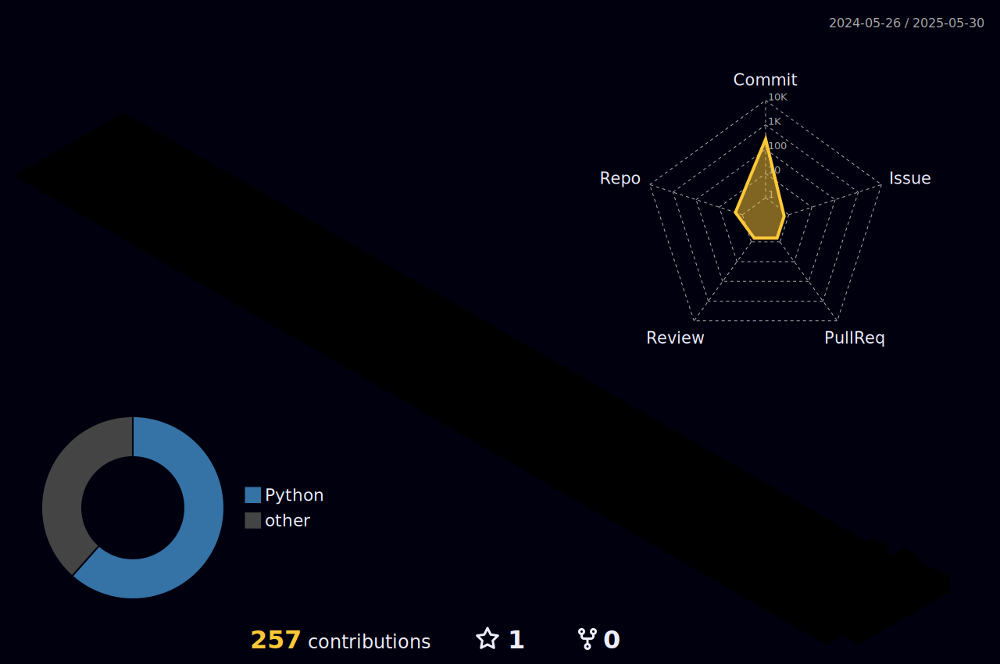

## Hi there 👋
<p align="left"> 
  
  <a href="https://github.com/Sierraki/LC_Solve">
   
  </a>



<!--START_SECTION:waka-->


**I'm an Early 🐤** 

```text
🌞 Morning    16 commits     ██░░░░░░░░░░░░░░░░░░░░░░░   8.08% 
🌆 Daytime    86 commits     ██████████░░░░░░░░░░░░░░░   43.43% 
🌃 Evening    71 commits     █████████░░░░░░░░░░░░░░░░   35.86% 
🌙 Night      25 commits     ███░░░░░░░░░░░░░░░░░░░░░░   12.63%

```
📅 **I'm Most Productive on Wednesday** 

```text
Monday       29 commits     ███░░░░░░░░░░░░░░░░░░░░░░   14.65% 
Tuesday      27 commits     ███░░░░░░░░░░░░░░░░░░░░░░   13.64% 
Wednesday    57 commits     ███████░░░░░░░░░░░░░░░░░░   28.79% 
Thursday     53 commits     ██████░░░░░░░░░░░░░░░░░░░   26.77% 
Friday       16 commits     ██░░░░░░░░░░░░░░░░░░░░░░░   8.08% 
Saturday     8 commits      █░░░░░░░░░░░░░░░░░░░░░░░░   4.04% 
Sunday       8 commits      █░░░░░░░░░░░░░░░░░░░░░░░░   4.04%

```


📊 **This Week I Spent My Time On** 

```text
⌚︎ Time Zone: Asia/Shanghai

💬 Programming Languages: 
Other                    21 hrs 22 mins      ███████████████░░░░░░░░░░   61.5% 
Python                   12 hrs 40 mins      █████████░░░░░░░░░░░░░░░░   36.47% 
Markdown                 14 mins             ░░░░░░░░░░░░░░░░░░░░░░░░░   0.69% 
SQL                      12 mins             ░░░░░░░░░░░░░░░░░░░░░░░░░   0.6% 
Stata                    8 mins              ░░░░░░░░░░░░░░░░░░░░░░░░░   0.42%

🔥 Editors: 
Edge                     20 hrs 49 mins      ███████████████░░░░░░░░░░   59.91% 
VS Code                  13 hrs 43 mins      █████████░░░░░░░░░░░░░░░░   39.49% 
DataGrip                 12 mins             ░░░░░░░░░░░░░░░░░░░░░░░░░   0.61%

💻 Operating System: 
Windows                  34 hrs 46 mins      █████████████████████████   100.0%

```


 Last Updated on 31/05/2025
<!--END_SECTION:waka-->
